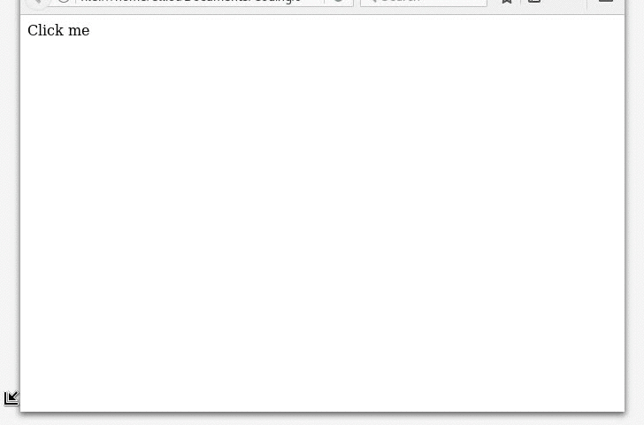
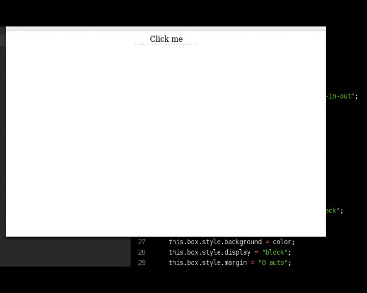

# Pop & Drop
A lightweight pop-up and drop-down purely java-script library

## Pop-ups


```
let popup = new Pop("Header Text", "Inner Content");
popup.show(); // Display the Popup
popup.close(); // Used to pragmatically close the popup
```

## Drop-downs


```
let dropdown = new Drop(parent, width, height, color, unit);
dropdown.setContent("Hello There!");
dropdown.drop(); // Drop the element into view
dropdown.rise(); // Hide the element again
```
